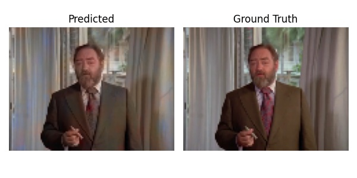
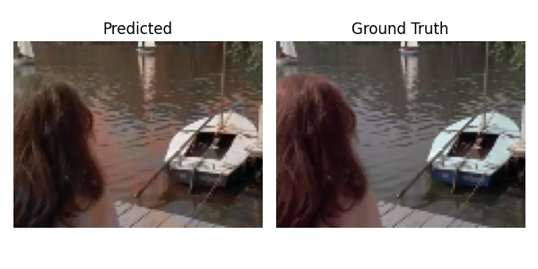
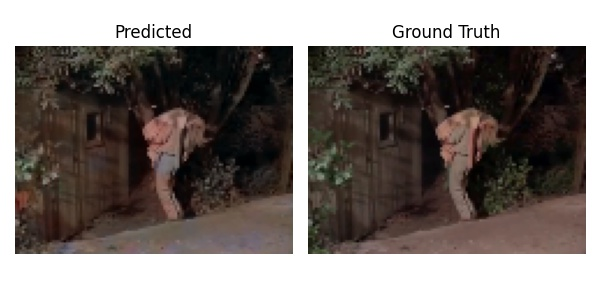
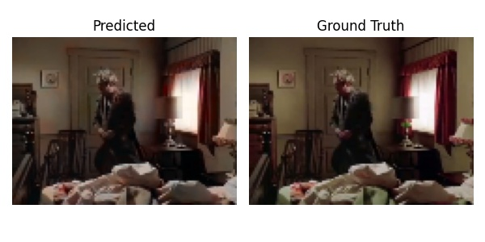

# Colorizer
Image colorization with GAN

## Table of Contents
- [Motivation](#motivation)
- [Related Work](#related-work)
- [Data](#data)
- [Architecture](#architecture)
- [Results](#results)
  - [Sample Video](#sample-video)
  - [Sample Images](#sample-images)
- [Further Work](#further-work)
- [Usage](#usage)
    - [Train](#train)
    - [Evaluate](#evaluate)
- [Technical Notes](#technical-notes)
- [Caveat](#caveat)

## Motivation
Image and video colorization by hand is a very labour-intensive process. In recent years with the advances in machine learning techniques, automatic colorization has gain significant traction in the field. In this project, I attempt to bring color to a clip from the original *Twilight Zone* using the GAN (generative adversarial network) architecture. This repository consists of scripts that gather and process data, build and train the network as well as a subset of training data, trained model weights, and sample outputs.

## Related Work
- [Learning Representations for Automatic Colorization](https://arxiv.org/abs/1603.06668) ([code](https://github.com/gustavla/autocolorize))
- [DeOldify](https://deoldify.ai/) ([code](https://github.com/jantic/DeOldify))
- [Image Colorization using Transfer Learning](https://github.com/dipanjanS/hands-on-transfer-learning-with-python/blob/master/notebooks/Ch12%20-%20Image%20Colorization/colornet_vgg16.ipynb)

## Data
The training set consists of 15,000 images from a 70s color TV show called *Ghost Story* and the test images are from the *Twilight Zone*. I used [pytube](https://github.com/pytube/pytube) to download YouTube videos and [OpenCV](https://opencv.org/) to capture images from videos, transform them from `RGB` to `LAB` colorspace, and resize the images for sake of training efficiency. The advantage of using `LAB` colorspace is that the lightness `L` layer is the grayscale version of the image, separated from the color channels.

All images are stored in a single HDF5 file as arrays of unsigned integer type in two tables (`Train` and `Test`). Due to size limitation, only a subset (200 images from the trianing set, 50 from test set) is provided in the repo. When loaded, they are cast as floats and re-scaled to be between 0 and 1 before being passed into the network.

## Architecture
 GAN is a popular model for image (or synthetic data, more generally) generation. The core idea is that a generative and a discriminative network will be trained simultaneously where the generative network attempts to create data similar to the real data so that the discriminative network cannot distinguish while the discriminative network learns to separate fake from real data.

Since the goal is to generate believable colors for grayscale images, GAN seems to be a suitable choice for this task. The main architecture is inspired by [Unsupervised Diverse Colorization via Generative Adversarial Networks](https://arxiv.org/pdf/1702.06674.pdf) ([code](https://github.com/ccyyatnet/COLORGAN)) with slight modifications. Both the generator and the discriminator use convolutional layers with strides of 1 to avoid resizing and to retain spatial information. I have tried other models the use strides greater than 1 or pooling layers, and artifacts such as color blocks and abrupt transition become apparent in the results.

The generator continuously concatenates the lightness channel before each convolution operation since the image size is invariant through the layers. This is a convenient way to allow the network to leverage conditional information throughout. I also use a larger learning rate for the generator optimizer than the discriminator optimizer since the discriminator is getting too good too quickly when the learning rates are equal.

Instead of Wasserstein loss, I opt for mean squared error in the generator and binary cross entropy in the discriminator. Wasserstein loss causes the training to be extremely unstable and the authors of the original paper also noted that Wasserstein did not improve the performance for them.

## Results
Perhaps because most screenshots have human faces in them, the network is pretty good at detecting and coloring faces. However, for objects that don't have any distinct color, the network often opts for the safe brownish color to minimize errors.

### Sample Video
This is a short clip from the original (black and white) *Twilight Zone*.

<a href="https://youtu.be/05HJvR4cuwM"></a>

And here is the network output.

<a href="https://youtu.be/rqL_XY6TXzQ"></a>

### Sample Images
A gallery of images from the training set.







## Further Work
A more diverse training dataset might help with more general object colorization. A generator that leverages a pre-trained image recognition and segmentation model can reduce training time and potentially improve performance. However, the pre-trained models are expecting the input to have three channels (since they were trained on color images) so some adjustments are needed. In addition, a different loss function that compares output in a reduced dimensionality space in the generator might alleviate the constant brown color prediction issue. One such example would be a VGG loss.  

Currently, the model expects the input image to be 120 by 90 pixels. This is entirely arbitrary and only restricted by the first layer of the generator which projects the noise vector onto input image. A more dynamic approach can be used to remove the image size restriction.  

## Usage
A Dockerfile is included in this repo if you wish to run the model end-to-end in a container (CPU only).

### Train
The command below builds the full database and train the network from scratch.
```shell
python train.py --build_db
```
You can omit the `--build_db` flag if you've already built the database. Use the `--load_weights` flag if you wish to use the pre-trained weights and `--epoch [some number]` if you wish to overwrite the default number of epochs (100).

### Evaluate
To evaluate the trained network on a single image (say, image #8) from the training set:
```shell
python evaluate.py --train 8
```

To evaluate on multiple images from the training set:
```shell
python evaluate.py --train 0 99 175
```

To evaluate on the test video (note that codec is missing from the OpenCV Python library, see [Caveat](#caveat)):
```shell
python evaluate.py --test
```

The output images and video will be stored in the `data` directory.

## Technical Notes
The model is written in Python using TensorFlow. The network was trained on a single NVIDIA P5000 GPU over 500 epochs, with each epoch taking about 5 minutes.

## Caveat
If you install OpenCV through pip, it doesn't come with the necessary encoding
for generating the MP4 file from test data (see this
[Github issue](https://github.com/opencv/opencv-python/issues/207)). I had
installed OpenCV through APT instead on Ubuntu.
```shell
sudo apt-get install python3-opencv
```
